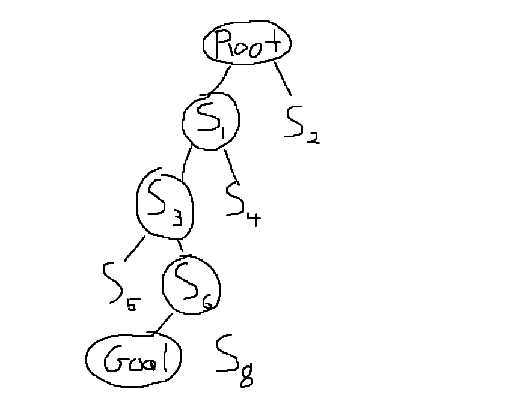
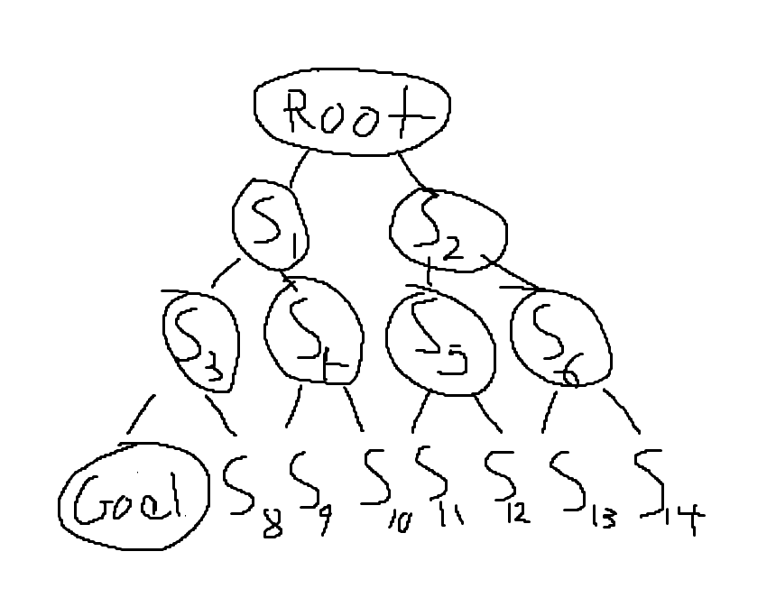
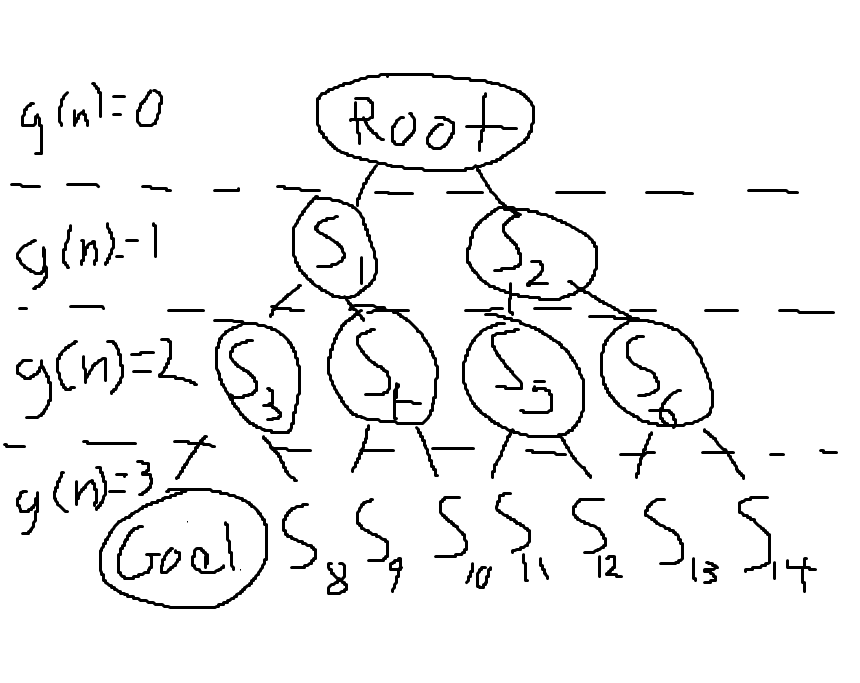
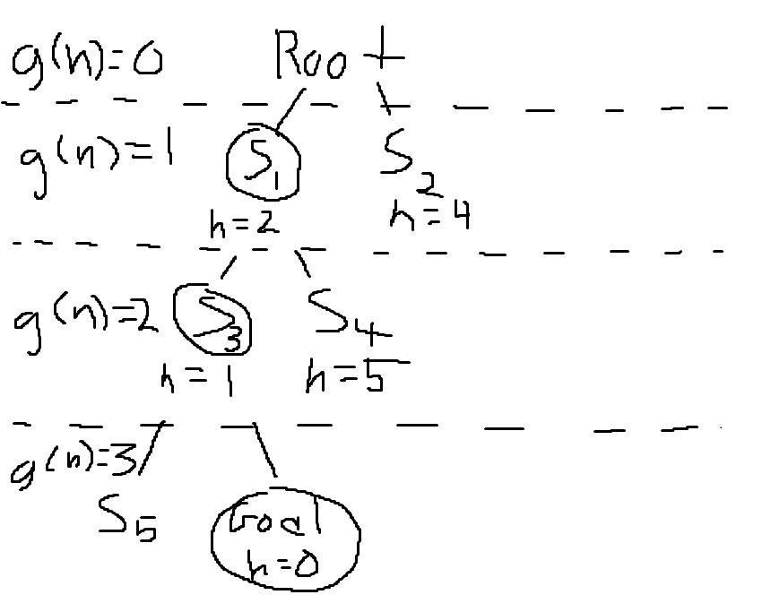
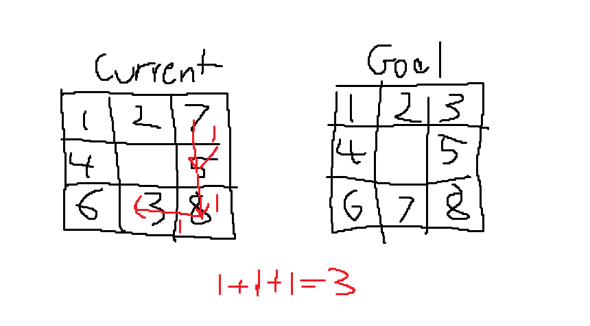
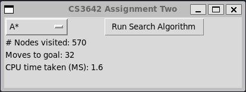

# cs3642-assignment-two

## Information
- Course: CS3642
- Student Name: Daniel Tebor
- Student ID: 000982064
- Assignment #: 2
- Due Date: 10/13
- Signature: Daniel Tebor

## Programming Eight-Puzzle
Eight-Puzzle is a puzzle in which the numbers 1-8 are randomly placed on a 3x3 grid. One of the tiles on the grid is blank. The goal of the puzzle is to rearrange the tiles to match a goal board. To achieve this, the empty tile can swap places with any horizontally or vertically adjacent tile. Search algorithms such as DFS, BFS, UCS, and A* are a means to achieve this algorithmically, which is what is showcased here.

### Representing a State
Each state in eight-puzzle has some important information that needs to be stored. To store this information, a wrapping node struct was created.

```c
typedef struct Node Node;

struct Node {
    const Node* parent; // Pointer to parent node
    Node* next; // Pointer to next node in linked list. Used for hashing.
    unsigned int state[3][3]; // Board state
    unsigned int depth; // Depth of node in search tree
    unsigned int heuristic; // Heuristic value of node
};
```

The state of the 3x3 grid of numbers is stored in a 3x3 matrix of unsigned integers. A 1D array could have also been used, but a 3x3 matrix is easier to visualize and is barely slower. The depth field tracks how many parents the node has and is important for tracking how far down the search tree the node is. The heuristic is used for search algorithms such as A*. The parent pointer is useful for tracing the found goal state back to the root (start state).

### Random start state
To generate a random start state, the goal state is randomly scrambled by choosing a random move 10,000 times. This is done to guarantee that the generated start state can be solved. Not all start states can reach the goal state. The start state is wrapped in a node that will serve as the root of the search algorithms.

```c
Node* generate_random_start_node() {
    Node* node = (Node*) malloc(sizeof(Node));
    
    // Copy goal state into node.
    unsigned int blank_x, blank_y;
    for (int y = 0; y < 3; y++) {
        for (int x = 0; x < 3; x++) {
            node->state[y][x] = goal_state[y][x];
            if (node->state[y][x] == 0) {
                blank_x = x;
                blank_y = y;
            }
        }
    }

    srand(time(NULL));

    // Randomly scramble the state. This garuntees the state can be solved.
    for (unsigned int i = 0; i < 10000; i++) {
        // Generate a random move 0-3.
        unsigned int move = rand() % 4;

        if (move == 0 && blank_x > 0) {
            // Swap blank tile with tile to the left of it.
            unsigned int left_tile = node->state[blank_y][blank_x - 1];
            node->state[blank_y][blank_x - 1] = 0;
            node->state[blank_y][blank_x] = left_tile;
            blank_x--;
        }
        else if (move == 1 && blank_y < 2) {
            // Swap blank tile with tile below it.
            unsigned int below_tile = node->state[blank_y + 1][blank_x];
            node->state[blank_y + 1][blank_x] = 0;
            node->state[blank_y][blank_x] = below_tile;
            blank_y++;
        }
        else if (move == 2 && blank_x < 2) {
            // Swap blank tile with tile to the right of it.
            unsigned int right_tile = node->state[blank_y][blank_x + 1];
            node->state[blank_y][blank_x + 1] = 0;
            node->state[blank_y][blank_x] = right_tile;
            blank_x++;
        }
        else if (move == 3 && blank_y > 0) {
            // Swap blank tile with tile above it.
            unsigned int above_tile = node->state[blank_y - 1][blank_x];
            node->state[blank_y - 1][blank_x] = 0;
            node->state[blank_y][blank_x] = above_tile;
            blank_y--;
        }
        else {
            i--;
        }
    }

    // Populate rest of node.
    node->parent = NULL;
    node->depth = 0;
    node->heuristic = UINT_MAX;

    return node;
}
```

The goal node state was static, as in it is the same for every run of a search algorithm.

```c
const unsigned int goal_state[3][3] = {
    {1, 2, 3},
    {8, 0, 4},
    {7, 6, 5}
};
```

### Expanding a Node
To expand a node, a child with each possible move from the current state must be generated. Additionally, any child with a state that has already been visited must be discarded to prevent infinite loops. The empty tile in each state can be moved up, down, left, or right. Of course, the move cannot move out of the grid, so such children are rejected. The node fields also need to be populated. The depth of a child must be +1 one of its parents and a heuristic for each child must be calculated if it is necessary. The following algorithm meets these requirements.

```c
Node** extend_node(const Node* node,
                   const Node** nodes_visited,
                   bool should_use_heuristic) {
    // Find blank tile.
    unsigned int blank_x = 0, blank_y = 0;
    bool blank_tile_found = false;

    for (unsigned int y = 0; y < 3; y++) {
        for (unsigned int x = 0; x < 3; x++) {
            if (node->state[y][x] == 0) {
                blank_x = x;
                blank_y = y;
                blank_tile_found = true;
                break;
            }
        }

        if (blank_tile_found) {
            break;
        }
    }

    // Generate child nodes starting from up and going clockwise.
    // Dynamically allocate so that array persists outside of function scope.
    Node** child_nodes = calloc(4, sizeof(Node*));
    unsigned int child_node_idx = 0;

    for (unsigned int i = 0; i < 4; i++) {
        // Dynamically allocate so that node persists outside of function scope.
        Node* child_node = malloc(sizeof(Node));
        // Copy state into child_node's state.
        memcpy(child_node->state, node->state, sizeof(node->state));
        
        if (i == 0 && blank_x > 0) {
            // Swap blank tile with tile to the left of it.
            unsigned int left_tile = child_node->state[blank_y][blank_x - 1];
            child_node->state[blank_y][blank_x - 1] = 0;
            child_node->state[blank_y][blank_x] = left_tile;
        }
        else if (i == 1 && blank_y < 2) {
            // Swap blank tile with tile below it.
            unsigned int below_tile = child_node->state[blank_y + 1][blank_x];
            child_node->state[blank_y + 1][blank_x] = 0;
            child_node->state[blank_y][blank_x] = below_tile;
        }
        else if (i == 2 && blank_x < 2) {
            // Swap blank tile with tile to the right of it.
            unsigned int right_tile = child_node->state[blank_y][blank_x + 1];
            child_node->state[blank_y][blank_x + 1] = 0;
            child_node->state[blank_y][blank_x] = right_tile;
        }
        else if (i == 3 && blank_y > 0) {
            // Swap blank tile with tile above it.
            unsigned int above_tile = child_node->state[blank_y - 1][blank_x];
            child_node->state[blank_y - 1][blank_x] = 0;
            child_node->state[blank_y][blank_x] = above_tile;
        }
        else {
            // Free child_node if it is not a valid child.
            free(child_node);
            continue;
        }

        // Populate blank fields in child_node.
        child_node->parent = node;
        child_node->depth = node->depth + 1;
        child_node->heuristic = 0;
        if (should_use_heuristic) {
            // Set the heuristic if it used.
            child_node->heuristic += calc_nilsson_sequence_score(child_node) + calc_summed_manhatten_distances(child_node);
        }

        // Add child_node to child_nodes if it's state does not already exist.
        if (!state_is_repeat(child_node, nodes_visited)) {
            child_nodes[child_node_idx++] = child_node;
        } else {
            // Free child_node if it is a repeat.
            free(child_node);
        }
    }

    return child_nodes;
}
```

You may note the variable MAX_NODES. This corresponds with the possible combinations of the state. The 3x3 grid has 9 states, each with a unique number, therefore the max number of states is 9!. The hashed array is initialized to this size.

### Checking if a state is a repeat
In order to check if a state has been visited yet, the child's state is searched for in a hashed array of nodes that have already been visited. This allows for a constant or almost constant search time.

```c
bool state_is_repeat(const Node* node,
                     const Node** nodes_visited) {
    // Check if Node already exists in nodes_visited.
    if (search(node, nodes_visited, MAX_NODES) == NULL) {
        return false;
    }

    return true;
}
```

## Depth First Search
Depth first search involves going all the way down a branch of nodes until the nodes can no longer be expanded. Once a branch has been fully expanded, the algorithm back-tracks and then expands any open nodes that have yet to be expanded along that branch. This is done until the goal is found.



To implement this functionality, a stack was used. When a node is visited, the node is popped off the stack and inserted into the hashed nodes_visited array. The children of the popped nodes are then pushed onto the stack.

```c
void depth_first_search(Node* start_node, SearchResult* result) {
    Stack nodes_to_visit;
    init_stack(&nodes_to_visit);

    Node** nodes_visited = calloc(MAX_NODES, sizeof(Node*));
    unsigned int num_nodes_visited = 0;
    
    Node* goal_node;

    // Record start time for algorithm execution.
    clock_t start_time = clock();

    // Push start node.
    // Copy start node so that it is not deallocated after each try.
    push(&nodes_to_visit, start_node);

    // Visit every node in the stack. When a node is extended in the loop,
    // the children are pushed. This causes the nodes to be visited in a DFS order.
    while (!stack_is_empty(&nodes_to_visit)) {
        Node* current_node = pop(&nodes_to_visit);
        insert(current_node, nodes_visited, MAX_NODES);
        num_nodes_visited++;

        // Check if current node is the goal state.
        if (check_states_are_equivalent(current_node->state, goal_state)) {
            goal_node = current_node;
            break;
        }
        
        // Extend current node and push children.
        // 3rd parameter is false as a heuristic is not used in DFS.
        Node** child_nodes = extend_node(current_node, (const Node**) nodes_visited, false);
        
        // Push children nodes.
        for (unsigned int i = 0; i < 4; i++) {
            if (child_nodes[i] != NULL) {
                push(&nodes_to_visit, child_nodes[i]);
            } else {
                break;
            }
        }

        // Free child nodes array to prevent a memory leak.
        free(child_nodes);
    }

    // Record end time for algorithm execution.
    clock_t end_time = clock();
    // Calculate time taken in milliseconds.
    double cpu_time_taken_ms = ((double) (end_time - start_time)) / CLOCKS_PER_SEC * 1000;
    
    // Fill out fields in the SearchResult struct.
    populate_search_result(result, nodes_visited, goal_node, num_nodes_visited, cpu_time_taken_ms);
}
```

## Breadth-First Search
Breadth first search involves visiting every child node at each depth, incrementally. The nodes at depth 1 are visited, then at depth 2, etc. until the goal is found or all possible nodes have been visited.



To implement this functionality, a queue was used. When a node is visited, it is dequeued, and its children are enqueued. This causes the search order to be depth-layer by depth-layer.

```c
void breadth_first_search(Node* start_node, SearchResult* result) {
    Queue nodes_to_visit;
    init_queue(&nodes_to_visit);

    Node** nodes_visited = calloc(MAX_NODES, sizeof(Node*));
    unsigned int num_nodes_visited = 0;
    
    Node* goal_node;

    // Record start time for algorithm execution.
    clock_t start_time = clock();

    // Enqueue start node.
    // Copy start node so that it is not deallocated after each try.
    enqueue(&nodes_to_visit, start_node);

    // Visit every node in the queue. When a node is extended in the loop,
    // the children are enqueued. This causes the nodes to be visited in a BFS order.
    while (!queue_is_empty(&nodes_to_visit)) {
        Node* current_node = dequeue(&nodes_to_visit);
        insert(current_node, nodes_visited, MAX_NODES);
        num_nodes_visited++;

        // Check if current node is the goal state.
        if (check_states_are_equivalent(current_node->state, goal_state)) {
            goal_node = current_node;
            break;
        }
        
        // Extend current node and enqueue children.
        // 3rd parameter is false as a heuristic is not used in BFS.
        Node** child_nodes = extend_node(current_node, (const Node**) nodes_visited, false);

        // Enqueue children nodes.
        for (unsigned int i = 0; i < 4; i++) {
            if (child_nodes[i] != NULL) {
                enqueue(&nodes_to_visit, child_nodes[i]);
            } else {
                break;
            }
        }

        // Free child nodes array to prevent a memory leak.
        free(child_nodes);
    }

    // Record end time for algorithm execution.
    clock_t end_time = clock();
    // Calculate time taken in milliseconds.
    double cpu_time_taken_ms = ((double) (end_time - start_time)) / CLOCKS_PER_SEC * 1000;

    // Fill out fields in the SearchResult struct.
    populate_search_result(result, nodes_visited, goal_node, num_nodes_visited, cpu_time_taken_ms);
}
```

## Uniform Cost Search
Uniform cost search involves visiting open nodes in the order of their cost, from lowest to highest. Newly expanded nodes are sorted into this order. The only effect metric for cost in the eight-puzzle is depth. This results in the UCS search order being the same as BFS. This is because all nodes of depth 1 will be visited first, then depth 2, etc.



The implementation is almost identical to BFS, but a priority queue is used instead of a queue. The priority queue is sorted using the depth.

```c
void uniform_cost_search(Node* start_node, SearchResult* result) {
    Queue nodes_to_visit;
    init_queue(&nodes_to_visit);

    Node** nodes_visited = calloc(MAX_NODES, sizeof(Node*));
    unsigned int num_nodes_visited = 0;
    
    Node* goal_node;
    
    // Record start time for algorithm execution.
    clock_t start_time = clock();

    // Enqueue start node.
    priority_enqueue(&nodes_to_visit, start_node);
    
    // Visit every node in the priority queue. When a node is extended in the loop,
    // the children are enqued and internally sorted so that those with the lowest
    // depth come first. This causes the nodes to be visited in a UCS order.
    while (!queue_is_empty(&nodes_to_visit)) {
        Node* current_node = dequeue(&nodes_to_visit);
        insert(current_node, nodes_visited, MAX_NODES);
        num_nodes_visited++;

        // Check if current node is the goal state.
        if (check_states_are_equivalent(current_node->state, goal_state)) {
            goal_node = current_node;
            break;
        }
        
        // Extend current node and enqueue children.
        // 3rd parameter is false as a heuristic is not used in UCS.
        Node** child_nodes = extend_node(current_node, (const Node**) nodes_visited, false);

        // Enqueue children nodes.
        for (unsigned int i = 0; i < 4; i++) {
            if (child_nodes[i] != NULL) {
                priority_enqueue(&nodes_to_visit, child_nodes[i]);
            } else {
                break;
            }
        }

        // Free child nodes array to prevent a memory leak.
        free(child_nodes);
    }

    // Record end time for algorithm execution.
    clock_t end_time = clock();
    // Calculate time taken in milliseconds.
    double cpu_time_taken_ms = ((double) (end_time - start_time)) / CLOCKS_PER_SEC * 1000;

    // Fill out fields in the SearchResult struct.
    populate_search_result(result, nodes_visited, goal_node, num_nodes_visited, cpu_time_taken_ms);
}
```

## A* Search
A* search is similar to UCS, except the search order is also informed by a heuristic. The heuristic for each node is added to the depth, and the priority queue is sorted with this value.



The implementation is almost identical to UCS, except the heuristic is enabled when extending nodes. This causes the heuristic to be non-zero like it is in UCS.

```c
void a_star_search(Node* start_node, SearchResult* result) {
    Queue nodes_to_visit;
    init_queue(&nodes_to_visit);

    Node** nodes_visited = calloc(MAX_NODES, sizeof(Node*));
    unsigned int num_nodes_visited = 0;
    
    Node* goal_node;
    
    // Record start time for algorithm execution.
    clock_t start_time = clock();

    // Enqueue start node.
    priority_enqueue(&nodes_to_visit, start_node);
    
    // Visit every node in the priority queue. When a node is extended in the loop,
    // the children are enqued and internally sorted so that those with the lowest
    // depth + heuristic value come first. This causes the nodes to be visited in a A* order.
    while (!queue_is_empty(&nodes_to_visit)) {
        Node* current_node = dequeue(&nodes_to_visit);
        insert(current_node, nodes_visited, MAX_NODES);
        num_nodes_visited++;

        // Check if current node is the goal state.
        if (check_states_are_equivalent(current_node->state, goal_state)) {
            goal_node = current_node;
            break;
        }
        
        // Extend current node and enqueue children.
        // 3rd parameter is true as a heuristic is used in A*.
        Node** child_nodes = extend_node(current_node, (const Node**) nodes_visited, true);

        // Enqueue children nodes.
        for (unsigned int i = 0; i < 4; i++) {
            if (child_nodes[i] != NULL) {
                priority_enqueue(&nodes_to_visit, child_nodes[i]);
            } else {
                break;
            }
        }

        // Free child nodes array to prevent a memory leak.
        free(child_nodes);
    }

    // Record end time for algorithm execution.
    clock_t end_time = clock();
    // Calculate time taken in milliseconds.
    double cpu_time_taken_ms = ((double) (end_time - start_time)) / CLOCKS_PER_SEC * 1000;

    // Fill out fields in the SearchResult struct.
    populate_search_result(result, nodes_visited, goal_node, num_nodes_visited, cpu_time_taken_ms);
}
```

### Manhattan Distance Heuristic
The Manhattan Distance heuristic measures the hamming distance between each tile in a node's state and the location it should be at in the goal state



```c
unsigned int calc_manhatten_distance(unsigned int tile_value, unsigned int x, unsigned int y) {
    unsigned int goal_x, goal_y;

    // Find goal position of tile.
    for (unsigned int y = 0; y < 3; y++) {
        for (unsigned int x = 0; x < 3; x++) {
            if (goal_state[y][x] == tile_value) {
                goal_x = x;
                goal_y = y;
            }
        }
    }

    // Calculate manhatten distance.
    return abs(goal_y - y) + abs(goal_x - x);
}

// Calculates a heuristic value by calculating the sum of
// the Manhatten distances of all tiles in the state compared to the goal.
unsigned int calc_summed_manhatten_distances(const Node* node) {
    unsigned int total_distances = 0;

    // Traverse state.
    for (unsigned int y = 0; y < 3; y++) {
        for (unsigned int x = 0; x < 3; x++) {
            unsigned int tile_value = node->state[y][x];
            if (tile_value != 0) {
                total_distances += calc_manhatten_distance(tile_value, x, y);
            }
        }
    }

    return total_distances;
}
```

### Nilsson Score Heuristic
The Nilsson score is a useful heuristic for determining the direction the search order should go in. The score starts at 0. If the center tile is nonzero, one is added. Then the state grid is traversed in clockwise order, ignoring the center. For the current tile, if the next tile is not what it should be, add 2 to the score. At the end, the score is multiplied by 3 to increase its weight. This heuristic is then added to the Manhattan distance heuristic.

```c
const unsigned int X_CLOCKWISE_ORDER[8] = {0, 1, 2, 2, 2, 1, 0, 0};
const unsigned int Y_CLOCKWISE_ORDER[8] = {0, 0, 0, 1, 2, 2, 2, 0};

// Add Nilsson's sequence score heuristic
unsigned int calc_nilsson_sequence_score(const Node* node) {
    unsigned int score = 0;

    // Add one to score if center not 0.
    if (node->state[1][1] != 0) {
        score++;
    }

    // Build state clockwise.
    unsigned int goal_state_clockwise[8];
    unsigned int node_state_clockwise[8];

    for (unsigned int i = 0; i < 8; i++) {
        goal_state_clockwise[i] = goal_state[Y_CLOCKWISE_ORDER[i]][X_CLOCKWISE_ORDER[i]];
        node_state_clockwise[i] = node->state[Y_CLOCKWISE_ORDER[i]][X_CLOCKWISE_ORDER[i]];
    }

    // Check if each tile clockwise matches 
    for (unsigned int i = 0; i < 7; i++) {
        if (node_state_clockwise[i] != goal_state_clockwise[i]) {
            score += 2;
        }
    }

    return score * 3;
}
```

## Running the Algorithms
To run the algorithms a simple TKinter GUI was set up. It allows for one of the 4 algorithms to be selected and then run. Then the number of visited nodes, the CPU time, and the number of moves to the goal are shown.

```python
root = tk.Tk()
root.title('CS3642 Assignment Two')
root.geometry('400x120')

# Option menu to select search algorithm.
chosen_search_alg_str = tk.StringVar(root, 'A*')
search_alg_options_menu = tk.OptionMenu(root, chosen_search_alg_str, 'A*', 'DFS', 'BFS', 'UCS')
search_alg_options_menu.config(anchor='w', width=8)
search_alg_options_menu.grid(row=0, column=0, sticky='w')

# Variables for showing the result
num_nodes_visited_str = tk.StringVar(root, '# Nodes visited: 0')
num_nodes_visited_label = tk.Label(root, textvariable=num_nodes_visited_str)
num_nodes_visited_label.config(anchor='w')
num_nodes_visited_label.grid(row=1, column=0, sticky='w')

moves_to_goal_str = tk.StringVar(root, 'Moves to goal: 0')
moves_to_goal_label = tk.Label(root, textvariable=moves_to_goal_str)
moves_to_goal_label.config(anchor='w')
moves_to_goal_label.grid(row=2, column=0, sticky='w')

cpu_time_taken_ms_str = tk.StringVar(root, 'CPU time taken (MS): 0.0')
cpu_time_taken_label = tk.Label(root, textvariable=cpu_time_taken_ms_str)
cpu_time_taken_label.config(anchor='w')
cpu_time_taken_label.grid(row=3, column=0, sticky='w')

def run_search_alg():
    search_alg_options_menu.config(state='disabled')
    run_search_alg_button.config(state='disabled')

    # Create random start node and run search algorithm.
    result = SearchResult()
    start_node = generate_random_start_node().contents

    alg = chosen_search_alg_str.get()
    if alg == 'A*':
        a_star_search(start_node, result)
    elif alg == 'DFS':
        depth_first_search(start_node, result)
    elif alg == 'BFS':
        breadth_first_search(start_node, result)
    elif alg == 'UCS':
        uniform_cost_search(start_node, result)
    
    # Update result labels.
    num_nodes_visited_str.set(f'# Nodes visited: {result.num_nodes_visited}')
    moves_to_goal_str.set(f'Moves to goal: {result.trace_size - 1}')
    cpu_time_taken_ms_str.set(f'CPU time taken (MS): {result.cpu_time_taken_ms:.1f}')

    search_alg_options_menu.config(state='normal')
    run_search_alg_button.config(state='active')

# Button to run search algorithm.
run_search_alg_button = tk.Button(root, text='Run Search Algorithm', 
                                  command=lambda: threading.Thread(target=run_search_alg, daemon=True).start())
run_search_alg_button.config(anchor='w')
run_search_alg_button.grid(row=0, column=1, sticky='w')

root.mainloop()
```

The end result looks like this:



## Testing Results
Each algorithm was run 1000 times, and the averages of each run were taken. Note that CPU time is not indicative of how fast the algorithm ran in real-time.<br>

| Algorithm | Avg # Nodes Visited   | Avg CPU Time (MS) | Avg Moves To Goal |
| --------- | --------------------- | ----------------- | ----------------- |
| DFS       | 22812                 | 14.5              | 21854             |
| BFS       | 33180                 | 1703.6            | 13.2              |
| UCS       | 28870                 | 1390.0            | 13.5              |
| A*        | 372                   | 1.0               | 26                |

From these results, it is evident that A* search is the best option if speed is very important. A* search visits a fraction of the nodes that the other algorithms do. However, the moves to the goal aren't optimal, albeit good. BFS is the best option if the best possible path needs to be found, but it is much much slower. The reason why it is so much slower than A* or DFS is that the queue uses an internal array that must be shifted to the left when a node is dequeued. This results in a much slower runtime. If the queue implementation were to be improved, the runtime would be similar to DFS. However, this still means that BFS would be much slower than A* search. UCS search gives identical results to BFS as the search order is the same as BFS. Finally, the worst option is DFS. DFS searches a similar amount of nodes compared to BFS, but the number of moves to the goal is terrible. This is because starting from root, the child nodes are essentially random moves until the goal is eventually found through backtracking, but the backtracking typically only starts once a significant depth has been reached.

## [Video Presentation](assets/video-presentation.mp4)

## Building and Running
To build the program, run the following command in the root directory of the project.

```bash
cmake build
```

This will build the library that the python code depends on. Then run the following command to run the python code.

```bash
# Linux
./run.sh
# Windows
run
```

If this has been done properly, a GUI window will open.